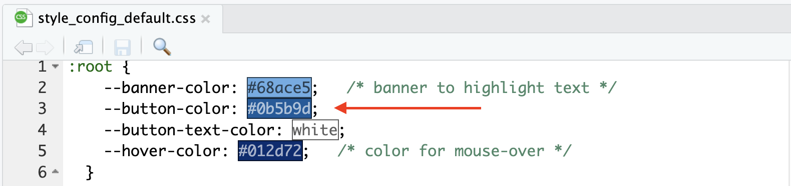

## Navigation bar

To change the part of the navigation bar that says "OTTR Quarto", modify the title within the `_quarto.yml` file.


```{r, fig.align='center', fig.alt= "Change nav bar", echo = FALSE, out.width="40%"}
knitr::include_graphics("resources/images/navbar.png")
```


## Overall theme

To change the color scheme/fonts of the website modify the `theme` in the `_quarto.yml` file (see [here](https://quarto.org/docs/output-formats/html-themes.html) for options):

```{r, fig.align='center', fig.alt= "Change theme", echo = FALSE, out.width="40%"}
knitr::include_graphics("resources/images/theme.png")
```

## Change the favicon

The small image that shows up on the browser can also be changed.

You can make a small image to replace the existing one by going to https://favicon.io/favicon-converter/ and uploading an image that you would like.

Next, simply replace the image called `favicon.ico` in the `images` directory within the `resources` directory with the image you just created and downloaded from the favicon converter website.

## Additional changes

To make additional changes to the style, you can modify the CSS files in the `assets` folder. Use `assets/style_config_default.css` for color variables and `assets/style.css` for style rules. This [website](https://www.w3schools.com/css/) has great information about css code.

As an example, if you wanted to change the button color, you could change `--button-color` in `assets/style_config_default.css`. You can also use a hex color code like those that can be found at this [website](https://htmlcolorcodes.com/), such as `#0b5b9d` to get a specific shade.


```{r, fig.align='center', fig.alt= "Change color of button", echo = FALSE, out.width="80%"}

```

If you add a new CSS class that is not already defined, use `var()` for any colors that should be easy to customize. For example, the `center` and `btn` classes in `assets/style.css` can be used to center text and create a button:

```{css}
.center {
  font-weight: bold;
  text-align: center;
}

.btn {
  background-color: var(--button-color);
  border: none;
  color: var(--button-text-color);
  padding: 8px 20px;
  cursor: pointer;
  font-size: 14px;
}

.btn:hover {
  background-color: var(--hover-color);
}
```

Then you can apply the classes to a page. For example, the `center` class and `btn` class can be added to `index.qmd` by using:

```
<p class = "center">
Centered text!
</p>

<button class = "btn">
Button text!
</button>
```

You can also use classes together. For example, the `banner_color` class can be combined with the `center` class:

```
<div class = "banner_color center">
Banner text!  
</div>
```

The `banner_color` class is defined in `assets/style.css` and uses the `--banner-color` value from `assets/style_config_default.css`:

```{css}
.banner_color {
  background-color: var(--banner-color);
  font-weight: bold;
}
```

Also checkout the [Quarto docs](https://quarto.org/docs/websites/#workflow) for more customization of the pages.
